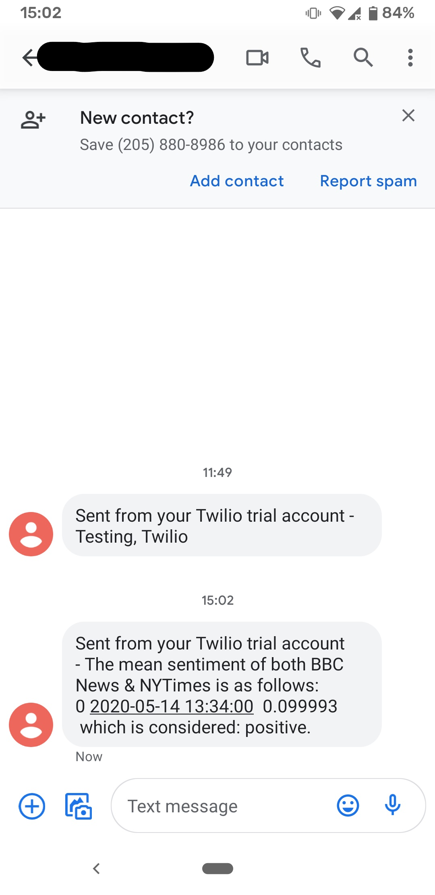

# SMART SEND 

Version 0.2.0 (Updated June, 2020)
This project needs a better name.

*Disclosure*  This script utilizes webscraping/webcrawling, which may violate terms of conditions or local laws.
This repository and its owning contributor are not responsible for the actions of those that utilize this codebase. 

---

### Current Functionality

* Ingest scraped data from a sample of news sources.  Specifically, headlines of news articles.
* Insert data to sqlite3 database.
* Run sentiment analysis, utilizing pretrained model, to identify sentiment score.
* Aggregate scores for the script run and send via Twilio SMS API.
*Not an NLP expert, so aggregating compound NLP scores by mean is the default*

### Upcoming Features

* Ability to receive SMS for stock tickers.
1. Scrape news articles for sentiment of ticker.
2. Retrieve houring moving average of ticker price.
3. Send aggregate sentiment and moving average slope.
4. *Add webhook (probably AWS Lambda) for Twilio HTTP callbacks.*
* Add news sources (and pivot to APIs where possible).
* Add multiprocessing for remaining scrapers.
* Create notification for drastic pivots in overall sentiment.

## Required Changes
* Finish "Upcoming Features" tasks.
* Rename variables.
* Add proper tests.
* Clean up and/or add in-code comments.

--- 

## Contributions

I encourage anyone and everyone interested to contribute to the project as they see fit.  There is much left to be desired.

---

## Setup
## General Sentiment

### From Code

1. Download repository.  

2. Download dependencies:

`pip install -r requirements.txt`

3. Setup database (file-based) by navigating to /src/db:

*`python createdb.py`

*`python schema.py`

4. Run script by navigating to /src:

* **You will require a Twilio account to authenticate into the Twilio API**
* `python test.py`

## Sample Output 

## Ticker Price vs Sentiment

### From Code
*Pending*

---

## Dependencies
Python 3.8.2

See docs/requirements.txt

---

## LICENSE
SmartSend is licensed under the MIT License – please read LICENSE.md for details.

---

## Acknowledgements
Twilio for their API.  AlphaVange for their API.  For anyone that builds/maintains the dependencies used.

